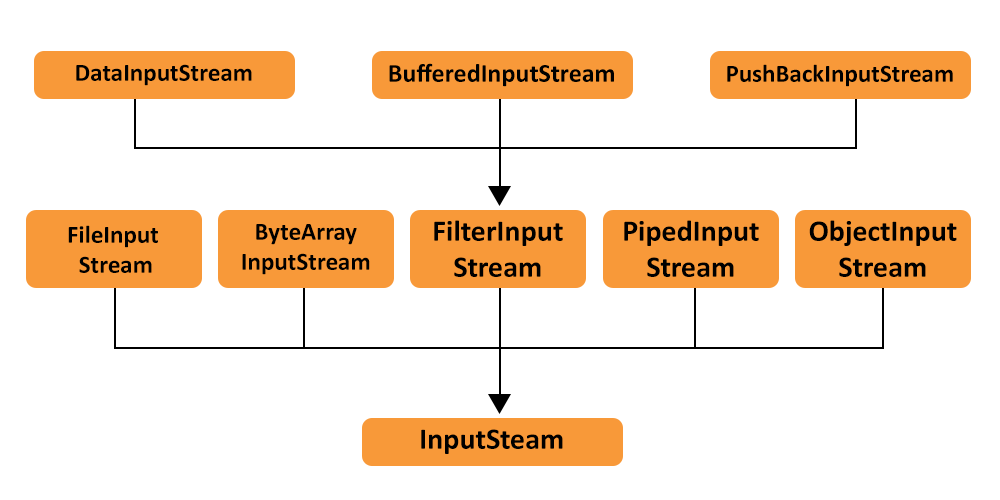
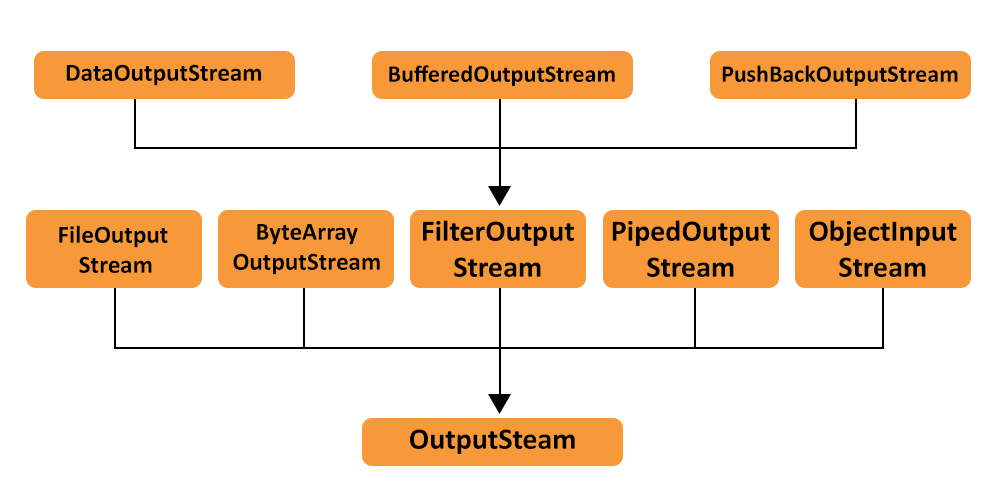

Para manipular arquivos no Java utilizamos o conceito de fluxo de entrada e fluxo de saida.  

É como criar um conexao com  filesystem, e estabelecer um caminho por onde os dados entrarão ou sairão do programa

Esse é o conceito de IO Streams, ou seja Input e Output Streams

Os fluxos de entrada ou seja de Input permitem que trabalhemos com diversos times de dados dependendo da implementacao que utilizamos

da mesma forma que para escrita podemos manipular e gerar diferentes tipos de arquivos variando pela implementacao

No java podemos fazer uso das bibliotecas Java.io e java.nio que nos auxiliam com diversos recursos para trabalhar os dados

O Java IO, permite que efetuemos operacoes de leitura(read) e escrita(write)

No java IO( Input Output) a maniupulacao de dados acontece de forma direta na conexao e isso torna a uma operacao read() ou write() um a ação blocante.  
ou seja, a thread que esta executando a operação fica travada ate o fim de sua execucao( close())

leitura File System  -> ( Input Stream  -> Programa consegue processar dados )
 - santander recebe do itau arquivo
   - ler os dados
   - processar
   - salvar bd

( programa processando dados -> Output Stream) -> escrita no file System
fila transações|consulta o bd com transacoes daquele dia  
- organizar os dados
- filtrar por banco de destino gerar arquivo por destino
  - arquivo itau
  - arquivo bb
  - arquivo caixa
  - arquivo diferente internacional

- envia o arquivo pro banco de destino

data-hora, numero, min inicio, min fim, tipo conexao etc.

arq_transacoes_bancarias
 - cliente a , valor, cliente b
 - cliente a , valor, cliente b
 - cliente a , valor, cliente b
 - cliente a , valor, cliente b

---
----

O Java IO( jdk 1) nos permite uma estrutura simples, e pratico para manipular arquivos 
no Java, porém não nos permite ter flexibilidade ao trabalhar com dados não sequenciais 
e não permitir escalar as operações, dado o seu comportamento bloqueante(trava a tread
que esta executando leitura ou escrita).
Ao necessitar executar múltiplas operações ao mesmo tempo isso tera um custo computacional
elevado.

Ja o Java NIO( New Input Output, jdk 1.4) permite que utilizemos fluxos de alto desempenho, 
e suas operações são não bloqueantes, os dados sao lidos e armazenados em buffer e o 
programa processa os dados de forma assíncrona, o mesmo se aplica para escrita, 
porém dada a sua flexibilidade traz consigo uma maior complexidade na concepção, 
ou seja, o código resultante sera maior e consequentemente mais difícil de manter. 

Pode ser necessário dado a algum requisito de negócio, como obter maior desempenho e escalabilidade.

O Java NIO 2 ( veio no jdk 7 ), trouxe os pacotes File auxiliando muito a manipulação de arquivos, 
apesar de ainda ser complexo é mais otimizado que o NIO.

Referencias externas:
https://www.geeksforgeeks.org/java-io-tutorial/
