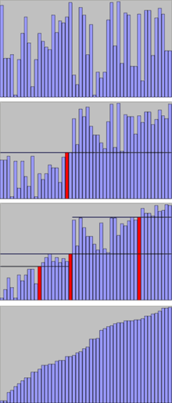
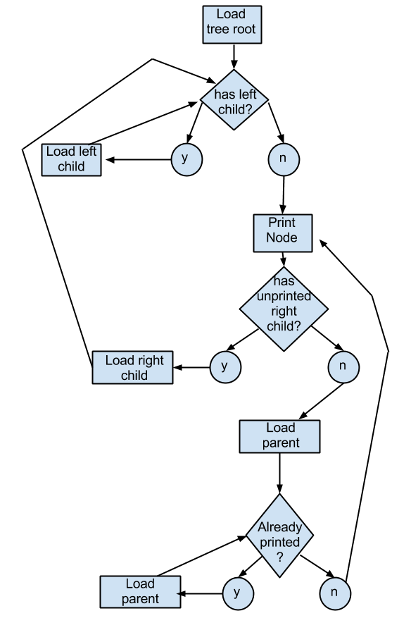

## Selection Sort

Percore o array diversas vezes, adicionando o menor elemento no inicio do array.

ex: na primeira passada move o menor elemento para a posicao 0, 
na segunda passada move o array para a posicao 1 e assim por diante 
isso é repetido ate completar o array.


## Bubble Sort

O bubble sort Compara pares de elementes ordenando eles, e repete esse passo ate completar o array

```
procedure bubbleSort( A : lista de itens ordenaveis ) defined as:
do
trocado := false
for each i in 0 to length( A ) - 2 do:
// verificar se os elementos estão na ordem certa
if A[ i ] > A[ i + 1 ] then
// trocar elementos de lugar
trocar( A[ i ], A[ i + 1 ] )
trocado := true
end if
end for
// enquanto houver elementos sendo reordenados.
while trocado
end procedure
```


## Merge Sort

É um algoritmo que tem como base a recursividade, ele divide o array em duas 
partes, cada parte é dividida novamente e depois de nao ter mais divisoes 
comeca o processo de mesclar, merge, das metades em ordem. 

Tem um alto consumo de memoria e tempo.  


## Quick Sort

O quick Sort com base em elemento aleatorio da lista( pivo ), separa todos os 
demais em maior e menor que esse pivo. e esse passo se repete a cada vez.  


exemplo de etapas



## Tree Sort

Uma ordenacao por arvore, adiciona os elementos em uma arvore de busca 
binaria e a partir dessa arvore efetua a busca objtendo os elementos em ordem.

Arvore binaria





##

Comparacao

| Algoritmo | Melhor | Médio     | Pior       |
| ---|---|-----------|------------|
| Selection sort | O(n²)|O(n²)|O(n²)|
| Bubble sort | O(n)| O(n²)| O(n²)|
| Merge sort | O(nlog2n) | O(nlog2n) | O(nlog2n)  |
| Quick sort |  	O(nlog2n) | O(nlog2n)| O(n²)|


